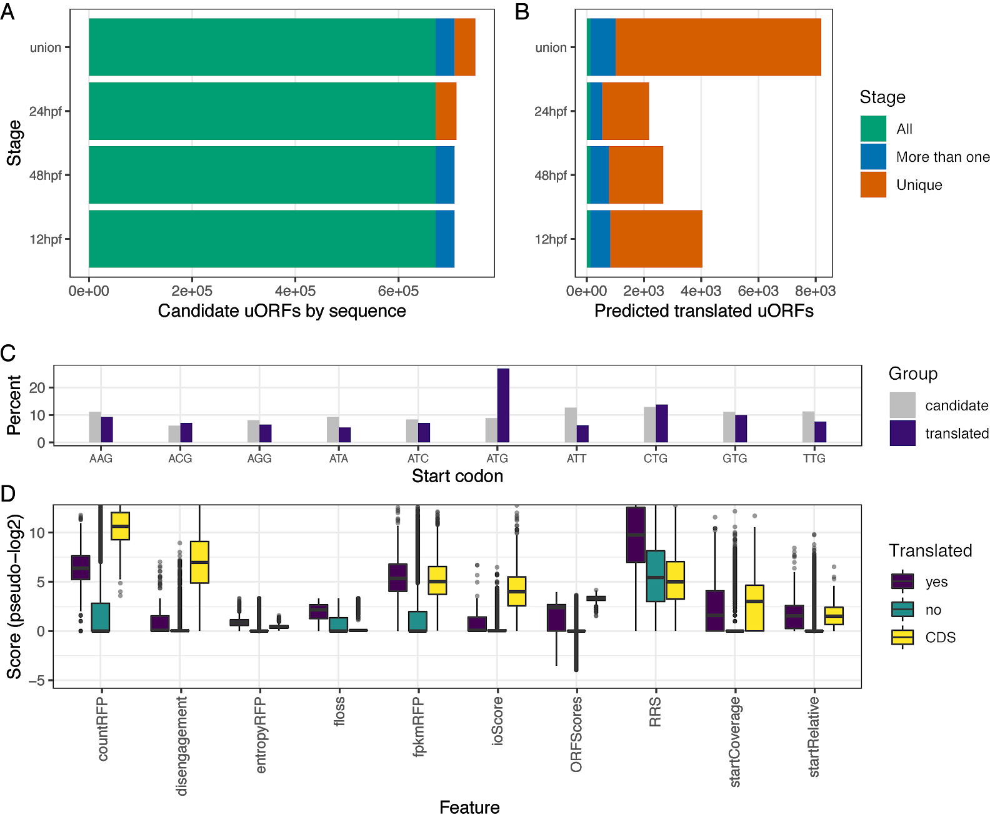

uORFomePipe: R package for prediction and analysis of uORFs
==============================================================================

This package is still under development, although this version is stable and can be used.

#### About


uORFomePipe is a R package containing a prediction pipeline and analysis using Ribo-Seq, RNA-Seq, Cage-Seq. related to transcriptomics.

- 1. set up parameters and experiment
- 2. Find new cage leaders
- 3. Find candidate uORFs (possible by sequence)
- 4. Create unique uORF ID's
- 5. Create database objects
- 6. Insert into database Ribo-seq, RNA-seq & Sequence features 
- 7. Predict uORFs from features
- 8. Analysis and plots


#### Installation
Package is available here on github (R version >= 3.6.0)
```r
if (requireNamespace("devtools")) {
  if (requireNamespace("uORFomePipe")) {
    library(uORFomePipe)
  } else {
    devtools::install_github("Roleren/uORFomePipe", dependencies = TRUE); quit(save = "n")
  }
} else {
  install.packages("devtools"); quit(save = "n")
}
```  

#### Tutorial
Here we show an example of predicting active uORFs between 3 stages in zebrafish
For you to run, make a new script window in R and paste in the parts.

# Preparing NGS data and annotation as ORFik experiment
To prepare the Ribo-seq, RNA-seq and CAGE, we make the data into ORFik experiment.
This is to make sure no mistakes are made and all data is valid, and easier grouping of data.

First read about how ORFik experiment works:
[ORFik experiment tutorial](https://bioconductor.org/packages/release/bioc/vignettes/ORFik/inst/doc/ORFikExperiment.html)

```r
library(uORFomePipe)
#¤¤¤¤¤¤¤¤¤¤¤¤¤¤¤¤¤¤¤¤¤¤¤¤¤¤¤¤¤¤¤¤¤¤¤¤¤¤¤¤¤¤¤¤¤¤¤¤¤¤¤¤¤¤¤¤¤¤¤¤¤¤¤¤¤¤¤¤¤¤¤¤¤¤¤¤¤¤¤¤¤¤¤¤¤¤¤¤¤¤¤¤¤¤¤¤¤#
# Create experiments (1. CAGE, 2. Ribo-seq (RFP) and 3. RNA-seq (RNA))
#¤¤¤¤¤¤¤¤¤¤¤¤¤¤¤¤¤¤¤¤¤¤¤¤¤¤¤¤¤¤¤¤¤¤¤¤¤¤¤¤¤¤¤¤¤¤¤¤¤¤¤¤¤¤¤¤¤¤¤¤¤¤¤¤¤¤¤¤¤¤¤¤¤¤¤¤¤¤¤¤¤¤¤¤¤¤¤¤¤¤¤¤¤¤¤¤¤#
if (0) { # Do this only once!
  # CAGE
  create.experiment(dir = "/export/valenfs/data/processed_data/CAGE/nepal_2013_zebrafish/final_results/aligned_GRCz10", exper = "zf_nepal")
  df.cage <- read.experimentl("zf_nepal")
  simpleLibs(df.cage, addScoreColumn = TRUE, addSizeColumn = FALSE, method = "5prime"); remove.experiments(df.cage)
  # RFP
  create.experiment(dir = "/export/valenfs/data/processed_data/Ribo-seq/chew_2013_zebrafish/final_results/aligned_GRCz10/",
                    exper = "zf_Chew13", type = "bam")
  df.rfp <- read.experimentl("zf_Chew13")
  shiftFootprintsByExperiment(df.rfp, output_format = "bedo", accepted.lengths = 25:30)
  # RNA
  create.experiment(dir = "/export/valenfs/data/processed_data/RNA-seq/chew_2013_and_pauli_2012_zebrafish/final_results/aligned_GRCz10/sorted",
                    exper = "zf_Chew_RNA")
  df.rna <- read.experimentl("zf_Chew_RNA")
  simpleLibs(df.rna, addScoreColumn = TRUE, addSizeColumn = FALSE); remove.experiments(df.rna)
}
```

# Preparing NGS data and annotation as ORFik experiment
Here we subset to only do analysis on 3 stages: fertilzed(2to4 cells stage), Dome and Shield.
```r
#¤¤¤¤¤¤¤¤¤¤¤¤¤¤¤¤¤¤¤¤¤¤¤¤¤¤¤¤¤¤¤¤¤¤¤¤¤¤¤¤¤¤¤¤¤¤¤¤¤¤¤¤¤¤¤¤¤¤¤¤¤¤¤¤¤¤¤¤¤¤¤¤¤¤¤¤¤¤¤¤¤¤¤¤¤¤¤¤¤¤¤¤¤¤¤¤¤#
# INIT (START HERE)
#¤¤¤¤¤¤¤¤¤¤¤¤¤¤¤¤¤¤¤¤¤¤¤¤¤¤¤¤¤¤¤¤¤¤¤¤¤¤¤¤¤¤¤¤¤¤¤¤¤¤¤¤¤¤¤¤¤¤¤¤¤¤¤¤¤¤¤¤¤¤¤¤¤¤¤¤¤¤¤¤¤¤¤¤¤¤¤¤¤¤¤¤¤¤¤¤¤#
{ # This part will vary according to what your experiments looks like, here I pick 3 stages to use
  # Load experiments
  df.cage <- read.experiment("zf_nepal")
  df.rfp  <- read.experiment("zf_Chew13") # RNA-seq is optional, but makes results better
  df.rna  <- read.experiment("zf_Chew_RNA")
  # Subset experiments to stages / tissues we want analysed (they must exist in all 3)
  conditions <- c("", NA)
  stages <- c("Dome","Shield", "2to4Cell", "fertilized")
  df.rfp <- df.rfp[df.rfp$stage %in% stages & df.rfp$condition %in% conditions,]
  df.rna <- df.rna[df.rna$stage %in% stages & df.rna$condition %in% conditions,]
  df.cage <- df.cage[df.cage$stage %in% stages & df.cage$condition %in% conditions,]; df.cage[1,2] <- df.rna$stage[1]
  
  orfikDirs(mainPath = "/export/valenfs/projects/Hakon/uORFome_zebrafish", 
            df.rfp, df.rna, df.cage)
}
```
If the function orfikDirs does not give you an error, you are good to go.

# Creating the uORF features used to prediction
```r
#¤¤¤¤¤¤¤¤¤¤¤¤¤¤¤¤¤¤¤¤¤¤¤¤¤¤¤¤¤¤¤¤¤¤¤¤¤¤¤¤¤¤¤¤¤¤¤¤¤¤¤¤¤¤¤¤¤¤¤¤¤¤¤¤¤¤¤¤¤¤¤¤¤¤¤¤¤¤¤¤¤¤¤¤¤¤¤¤¤¤¤¤¤¤¤¤¤#
# 2. Find uORF search region per CAGE
#¤¤¤¤¤¤¤¤¤¤¤¤¤¤¤¤¤¤¤¤¤¤¤¤¤¤¤¤¤¤¤¤¤¤¤¤¤¤¤¤¤¤¤¤¤¤¤¤¤¤¤¤¤¤¤¤¤¤¤¤¤¤¤¤¤¤¤¤¤¤¤¤¤¤¤¤¤¤¤¤¤¤¤¤¤¤¤¤¤¤¤¤¤¤¤¤¤#
getLeadersFromCage(df.cage)

#¤¤¤¤¤¤¤¤¤¤¤¤¤¤¤¤¤¤¤¤¤¤¤¤¤¤¤¤¤¤¤¤¤¤¤¤¤¤¤¤¤¤¤¤¤¤¤¤¤¤¤¤¤¤¤¤¤¤¤¤¤¤¤¤¤¤¤¤¤¤¤¤¤¤¤¤¤¤¤¤¤¤¤¤¤¤¤¤¤¤¤¤¤¤¤¤¤#
# 3. Find candidate uORFs per CAGE 
#¤¤¤¤¤¤¤¤¤¤¤¤¤¤¤¤¤¤¤¤¤¤¤¤¤¤¤¤¤¤¤¤¤¤¤¤¤¤¤¤¤¤¤¤¤¤¤¤¤¤¤¤¤¤¤¤¤¤¤¤¤¤¤¤¤¤¤¤¤¤¤¤¤¤¤¤¤¤¤¤¤¤¤¤¤¤¤¤¤¤¤¤¤¤¤¤¤#
getCandidateuORFs(startCodons = "ATG|CTG|TTG|GTG|AAG|AGG|ACG|ATC|ATA|ATT")

#¤¤¤¤¤¤¤¤¤¤¤¤¤¤¤¤¤¤¤¤¤¤¤¤¤¤¤¤¤¤¤¤¤¤¤¤¤¤¤¤¤¤¤¤¤¤¤¤¤¤¤¤¤¤¤¤¤¤¤¤¤¤¤¤¤¤¤¤¤¤¤¤¤¤¤¤¤¤¤¤¤¤¤¤¤¤¤¤¤¤¤¤¤¤¤¤¤#
# 4. make uorf IDs (to get unique identifier per uORF)
#¤¤¤¤¤¤¤¤¤¤¤¤¤¤¤¤¤¤¤¤¤¤¤¤¤¤¤¤¤¤¤¤¤¤¤¤¤¤¤¤¤¤¤¤¤¤¤¤¤¤¤¤¤¤¤¤¤¤¤¤¤¤¤¤¤¤¤¤¤¤¤¤¤¤¤¤¤¤¤¤¤¤¤¤¤¤¤¤¤¤¤¤¤¤¤¤¤#
getIDsFromUorfs()

#¤¤¤¤¤¤¤¤¤¤¤¤¤¤¤¤¤¤¤¤¤¤¤¤¤¤¤¤¤¤¤¤¤¤¤¤¤¤¤¤¤¤¤¤¤¤¤¤¤¤¤¤¤¤¤¤¤¤¤¤¤¤¤¤¤¤¤¤¤¤¤¤¤¤¤¤¤¤¤¤¤¤¤¤¤¤¤¤¤¤¤¤¤¤¤¤¤#
# 5. CAGE atlas per tissue and uORF / cage leader objects
#¤¤¤¤¤¤¤¤¤¤¤¤¤¤¤¤¤¤¤¤¤¤¤¤¤¤¤¤¤¤¤¤¤¤¤¤¤¤¤¤¤¤¤¤¤¤¤¤¤¤¤¤¤¤¤¤¤¤¤¤¤¤¤¤¤¤¤¤¤¤¤¤¤¤¤¤¤¤¤¤¤¤¤¤¤¤¤¤¤¤¤¤¤¤¤¤¤#
createCatalogueDB(df.cage)
#¤¤¤¤¤¤¤¤¤¤¤¤¤¤¤¤¤¤¤¤¤¤¤¤¤¤¤¤¤¤¤¤¤¤¤¤¤¤¤¤¤¤¤¤¤¤¤¤¤¤¤¤¤¤¤¤¤¤¤¤¤¤¤¤¤¤¤¤¤¤¤¤¤¤¤¤¤¤¤¤¤¤¤¤¤¤¤¤¤¤¤¤¤¤¤¤¤#
# 6. Find sequence, Ribo-seq and RNA-seq features for training model
#¤¤¤¤¤¤¤¤¤¤¤¤¤¤¤¤¤¤¤¤¤¤¤¤¤¤¤¤¤¤¤¤¤¤¤¤¤¤¤¤¤¤¤¤¤¤¤¤¤¤¤¤¤¤¤¤¤¤¤¤¤¤¤¤¤¤¤¤¤¤¤¤¤¤¤¤¤¤¤¤¤¤¤¤¤¤¤¤¤¤¤¤¤¤¤¤¤#

makeTrainingAndPredictionData(df.rfp, df.rna, tissue = "all",
                              organism = organism)
```
# Prediction (when training data is ready)
```r
#¤¤¤¤¤¤¤¤¤¤¤¤¤¤¤¤¤¤¤¤¤¤¤¤¤¤¤¤¤¤¤¤¤¤¤¤¤¤¤¤¤¤¤¤¤¤¤¤¤¤¤¤¤¤¤¤¤¤¤¤¤¤¤¤¤¤¤¤¤¤¤¤¤¤¤¤¤¤¤¤¤¤¤¤¤¤¤¤¤¤¤¤¤¤¤¤¤#
# 7. Predict uORFs
#¤¤¤¤¤¤¤¤¤¤¤¤¤¤¤¤¤¤¤¤¤¤¤¤¤¤¤¤¤¤¤¤¤¤¤¤¤¤¤¤¤¤¤¤¤¤¤¤¤¤¤¤¤¤¤¤¤¤¤¤¤¤¤¤¤¤¤¤¤¤¤¤¤¤¤¤¤¤¤¤¤¤¤¤¤¤¤¤¤¤¤¤¤¤¤¤¤#
# Either split tissues, or use argument "all" for all combined
prediction <- predictUorfs(tissues = "all",
                           nthreads_h2o = max(45, detectCores()/3))
```
# Analysis
```r
#¤¤¤¤¤¤¤¤¤¤¤¤¤¤¤¤¤¤¤¤¤¤¤¤¤¤¤¤¤¤¤¤¤¤¤¤¤¤¤¤¤¤¤¤¤¤¤¤¤¤¤¤¤¤¤¤¤¤¤¤¤¤¤¤¤¤¤¤¤¤¤¤¤¤¤¤¤¤¤¤¤¤¤¤¤¤¤¤¤¤¤¤¤¤¤¤¤#
# 8. Analysis
#¤¤¤¤¤¤¤¤¤¤¤¤¤¤¤¤¤¤¤¤¤¤¤¤¤¤¤¤¤¤¤¤¤¤¤¤¤¤¤¤¤¤¤¤¤¤¤¤¤¤¤¤¤¤¤¤¤¤¤¤¤¤¤¤¤¤¤¤¤¤¤¤¤¤¤¤¤¤¤¤¤¤¤¤¤¤¤¤¤¤¤¤¤¤¤¤¤#
# CAGE usage analysis
predictionVsCageHits()

# Feature analysis
featureAnalysis(prediction, tissue = "all")
```  




Here is full script:
```r
library(uORFomePipe)
#¤¤¤¤¤¤¤¤¤¤¤¤¤¤¤¤¤¤¤¤¤¤¤¤¤¤¤¤¤¤¤¤¤¤¤¤¤¤¤¤¤¤¤¤¤¤¤¤¤¤¤¤¤¤¤¤¤¤¤¤¤¤¤¤¤¤¤¤¤¤¤¤¤¤¤¤¤¤¤¤¤¤¤¤¤¤¤¤¤¤¤¤¤¤¤¤¤#
# Create experiments (1. CAGE, 2. Ribo-seq (RFP) and 3. RNA-seq (RNA))
#¤¤¤¤¤¤¤¤¤¤¤¤¤¤¤¤¤¤¤¤¤¤¤¤¤¤¤¤¤¤¤¤¤¤¤¤¤¤¤¤¤¤¤¤¤¤¤¤¤¤¤¤¤¤¤¤¤¤¤¤¤¤¤¤¤¤¤¤¤¤¤¤¤¤¤¤¤¤¤¤¤¤¤¤¤¤¤¤¤¤¤¤¤¤¤¤¤#
if (0) { # Do this only once!
  library(ORFikPipeline) # This is a package I made for library preparation, others just use create.experiment from ORFik.
  # CAGE
  create.experimentl(dir = "/export/valenfs/data/processed_data/CAGE/nepal_2013_zebrafish/final_results/aligned_GRCz10", exper = "zf_nepal")
  df.cage <- read.experimentl("zf_nepal")
  simpleLibs(df.cage, addScoreColumn = TRUE, addSizeColumn = FALSE, method = "5prime"); remove.experiments(df.cage)
  # RFP
  create.experimentl(dir = "/export/valenfs/data/processed_data/Ribo-seq/chew_2013_zebrafish/final_results/aligned_GRCz10/", exper = "zf_Chew13", type = "bam")
  df.rfp <- read.experimentl("zf_Chew13")
  shiftFootprintsByExperiment(df.rfp, output_format = "bedo", accepted.lengths = 25:30)
  # RNA
  create.experimentl(dir = "/export/valenfs/data/processed_data/RNA-seq/chew_2013_and_pauli_2012_zebrafish/final_results/aligned_GRCz10/sorted", exper = "zf_Chew_RNA")
  df.rna <- read.experimentl("zf_Chew_RNA")
  simpleLibs(df.rna, addScoreColumn = TRUE, addSizeColumn = FALSE); remove.experiments(df.rna)
}
#¤¤¤¤¤¤¤¤¤¤¤¤¤¤¤¤¤¤¤¤¤¤¤¤¤¤¤¤¤¤¤¤¤¤¤¤¤¤¤¤¤¤¤¤¤¤¤¤¤¤¤¤¤¤¤¤¤¤¤¤¤¤¤¤¤¤¤¤¤¤¤¤¤¤¤¤¤¤¤¤¤¤¤¤¤¤¤¤¤¤¤¤¤¤¤¤¤#
# INIT (START HERE)
#¤¤¤¤¤¤¤¤¤¤¤¤¤¤¤¤¤¤¤¤¤¤¤¤¤¤¤¤¤¤¤¤¤¤¤¤¤¤¤¤¤¤¤¤¤¤¤¤¤¤¤¤¤¤¤¤¤¤¤¤¤¤¤¤¤¤¤¤¤¤¤¤¤¤¤¤¤¤¤¤¤¤¤¤¤¤¤¤¤¤¤¤¤¤¤¤¤#
{ # This part will vary according to what your experiments looks like, here I pick 3 stages to use
  # Load experiments
  library(ORFikPipeline) # This is a package I made for library preparation, others just use create.experiment from ORFik.
  df.cage <- read.experimentl("zf_nepal")
  df.rfp  <- read.experimentl("zf_Chew13") # RNA-seq is optional, but makes results better
  df.rna  <- read.experimentl("zf_Chew_RNA")
  # Subset experiments to stages / tissues we want analysed (they must exist in all 3)
  conditions <- c("", NA)
  stages <- c("Dome","Shield", "2to4Cell", "fertilized")
  df.rfp <- df.rfp[df.rfp$stage %in% stages & df.rfp$condition %in% conditions,]
  df.rna <- df.rna[df.rna$stage %in% stages & df.rna$condition %in% conditions,]
  df.cage <- df.cage[df.cage$stage %in% stages & df.cage$condition %in% conditions,]; df.cage[1,2] <- df.rna$stage[1]
  
  orfikDirs(mainPath = "/export/valenfs/projects/Hakon/uORFome_zebrafish", 
            df.rfp, df.rna, df.cage)
}

#¤¤¤¤¤¤¤¤¤¤¤¤¤¤¤¤¤¤¤¤¤¤¤¤¤¤¤¤¤¤¤¤¤¤¤¤¤¤¤¤¤¤¤¤¤¤¤¤¤¤¤¤¤¤¤¤¤¤¤¤¤¤¤¤¤¤¤¤¤¤¤¤¤¤¤¤¤¤¤¤¤¤¤¤¤¤¤¤¤¤¤¤¤¤¤¤¤#
# 2. Find uORF search region per CAGE
#¤¤¤¤¤¤¤¤¤¤¤¤¤¤¤¤¤¤¤¤¤¤¤¤¤¤¤¤¤¤¤¤¤¤¤¤¤¤¤¤¤¤¤¤¤¤¤¤¤¤¤¤¤¤¤¤¤¤¤¤¤¤¤¤¤¤¤¤¤¤¤¤¤¤¤¤¤¤¤¤¤¤¤¤¤¤¤¤¤¤¤¤¤¤¤¤¤#
getLeadersFromCage(df.cage)

#¤¤¤¤¤¤¤¤¤¤¤¤¤¤¤¤¤¤¤¤¤¤¤¤¤¤¤¤¤¤¤¤¤¤¤¤¤¤¤¤¤¤¤¤¤¤¤¤¤¤¤¤¤¤¤¤¤¤¤¤¤¤¤¤¤¤¤¤¤¤¤¤¤¤¤¤¤¤¤¤¤¤¤¤¤¤¤¤¤¤¤¤¤¤¤¤¤#
# 3. Find candidate uORFs per CAGE 
#¤¤¤¤¤¤¤¤¤¤¤¤¤¤¤¤¤¤¤¤¤¤¤¤¤¤¤¤¤¤¤¤¤¤¤¤¤¤¤¤¤¤¤¤¤¤¤¤¤¤¤¤¤¤¤¤¤¤¤¤¤¤¤¤¤¤¤¤¤¤¤¤¤¤¤¤¤¤¤¤¤¤¤¤¤¤¤¤¤¤¤¤¤¤¤¤¤#
getCandidateuORFs(startCodons = "ATG|CTG|TTG|GTG|AAG|AGG|ACG|ATC|ATA|ATT")

#¤¤¤¤¤¤¤¤¤¤¤¤¤¤¤¤¤¤¤¤¤¤¤¤¤¤¤¤¤¤¤¤¤¤¤¤¤¤¤¤¤¤¤¤¤¤¤¤¤¤¤¤¤¤¤¤¤¤¤¤¤¤¤¤¤¤¤¤¤¤¤¤¤¤¤¤¤¤¤¤¤¤¤¤¤¤¤¤¤¤¤¤¤¤¤¤¤#
# 4. make uorf IDs (to get unique identifier per uORF)
#¤¤¤¤¤¤¤¤¤¤¤¤¤¤¤¤¤¤¤¤¤¤¤¤¤¤¤¤¤¤¤¤¤¤¤¤¤¤¤¤¤¤¤¤¤¤¤¤¤¤¤¤¤¤¤¤¤¤¤¤¤¤¤¤¤¤¤¤¤¤¤¤¤¤¤¤¤¤¤¤¤¤¤¤¤¤¤¤¤¤¤¤¤¤¤¤¤#
getIDsFromUorfs()

#¤¤¤¤¤¤¤¤¤¤¤¤¤¤¤¤¤¤¤¤¤¤¤¤¤¤¤¤¤¤¤¤¤¤¤¤¤¤¤¤¤¤¤¤¤¤¤¤¤¤¤¤¤¤¤¤¤¤¤¤¤¤¤¤¤¤¤¤¤¤¤¤¤¤¤¤¤¤¤¤¤¤¤¤¤¤¤¤¤¤¤¤¤¤¤¤¤#
# 5. CAGE atlas per tissue and uORF / cage leader objects
#¤¤¤¤¤¤¤¤¤¤¤¤¤¤¤¤¤¤¤¤¤¤¤¤¤¤¤¤¤¤¤¤¤¤¤¤¤¤¤¤¤¤¤¤¤¤¤¤¤¤¤¤¤¤¤¤¤¤¤¤¤¤¤¤¤¤¤¤¤¤¤¤¤¤¤¤¤¤¤¤¤¤¤¤¤¤¤¤¤¤¤¤¤¤¤¤¤#
createCatalogueDB(df.cage)
#¤¤¤¤¤¤¤¤¤¤¤¤¤¤¤¤¤¤¤¤¤¤¤¤¤¤¤¤¤¤¤¤¤¤¤¤¤¤¤¤¤¤¤¤¤¤¤¤¤¤¤¤¤¤¤¤¤¤¤¤¤¤¤¤¤¤¤¤¤¤¤¤¤¤¤¤¤¤¤¤¤¤¤¤¤¤¤¤¤¤¤¤¤¤¤¤¤#
# 6. Find sequence, Ribo-seq and RNA-seq features for training model
#¤¤¤¤¤¤¤¤¤¤¤¤¤¤¤¤¤¤¤¤¤¤¤¤¤¤¤¤¤¤¤¤¤¤¤¤¤¤¤¤¤¤¤¤¤¤¤¤¤¤¤¤¤¤¤¤¤¤¤¤¤¤¤¤¤¤¤¤¤¤¤¤¤¤¤¤¤¤¤¤¤¤¤¤¤¤¤¤¤¤¤¤¤¤¤¤¤#

makeTrainingAndPredictionData(df.rfp, df.rna, tissue = "all",
                              organism = organism)

#¤¤¤¤¤¤¤¤¤¤¤¤¤¤¤¤¤¤¤¤¤¤¤¤¤¤¤¤¤¤¤¤¤¤¤¤¤¤¤¤¤¤¤¤¤¤¤¤¤¤¤¤¤¤¤¤¤¤¤¤¤¤¤¤¤¤¤¤¤¤¤¤¤¤¤¤¤¤¤¤¤¤¤¤¤¤¤¤¤¤¤¤¤¤¤¤¤#
# 7. Predict uORFs
#¤¤¤¤¤¤¤¤¤¤¤¤¤¤¤¤¤¤¤¤¤¤¤¤¤¤¤¤¤¤¤¤¤¤¤¤¤¤¤¤¤¤¤¤¤¤¤¤¤¤¤¤¤¤¤¤¤¤¤¤¤¤¤¤¤¤¤¤¤¤¤¤¤¤¤¤¤¤¤¤¤¤¤¤¤¤¤¤¤¤¤¤¤¤¤¤¤#
# Either split tissues, or use argument "all" for all combined
prediction <- predictUorfs(tissues = "all")


#¤¤¤¤¤¤¤¤¤¤¤¤¤¤¤¤¤¤¤¤¤¤¤¤¤¤¤¤¤¤¤¤¤¤¤¤¤¤¤¤¤¤¤¤¤¤¤¤¤¤¤¤¤¤¤¤¤¤¤¤¤¤¤¤¤¤¤¤¤¤¤¤¤¤¤¤¤¤¤¤¤¤¤¤¤¤¤¤¤¤¤¤¤¤¤¤¤#
# 8. Analysis
#¤¤¤¤¤¤¤¤¤¤¤¤¤¤¤¤¤¤¤¤¤¤¤¤¤¤¤¤¤¤¤¤¤¤¤¤¤¤¤¤¤¤¤¤¤¤¤¤¤¤¤¤¤¤¤¤¤¤¤¤¤¤¤¤¤¤¤¤¤¤¤¤¤¤¤¤¤¤¤¤¤¤¤¤¤¤¤¤¤¤¤¤¤¤¤¤¤#
# CAGE usage analysis
predictionVsCageHits()

# Feature analysis
featureAnalysis(prediction, tissue = "all")
```  

#### Feedback

Please feel free to provide feedback or desired functionality by creating a new issue on our github page.
