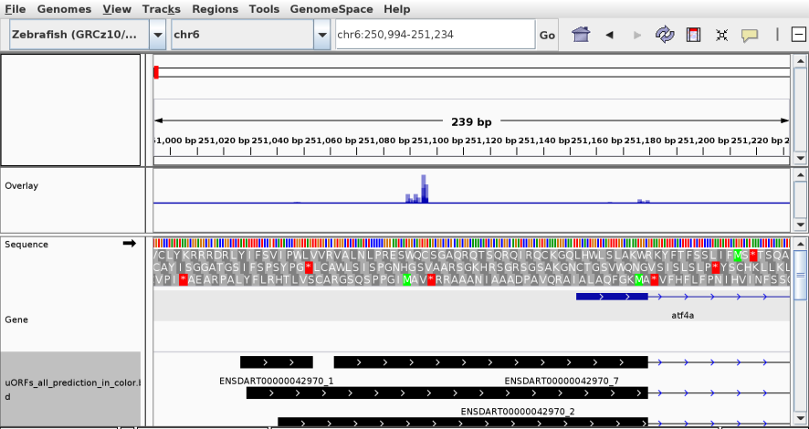

uORFomePipe: R package for prediction and analysis of uORFs
==============================================================================

This package is still under development, although this version is stable and can be used.

#### About


uORFomePipe is a R package containing a prediction pipeline and analysis tools using Ribo-Seq, RNA-Seq and CAGE.

- 1. set up parameters and experiment
- 2. Find new cage leaders
- 3. Find candidate uORFs (possible by sequence)
- 4. Create unique uORF ID's
- 5. Create database objects
- 6. Insert into database Ribo-seq, RNA-seq & Sequence features 
- 7. Predict uORFs from features
- 8. Analysis and plots


#### Installation
Package is available here on github (R version >= 3.6.0)
```r
if (requireNamespace("devtools")) {
  if (requireNamespace("uORFomePipe")) {
    library(uORFomePipe)
  } else {
    devtools::install_github("Roleren/uORFomePipe", dependencies = TRUE); quit(save = "n")
  }
} else {
  install.packages("devtools"); quit(save = "n")
}
```  

#### Tutorial
Here we show an example of predicting active uORFs between 3 stages in a zebrafish developmental timeline.
For you to run, make a new script window in R and paste in the script at the bottom of the page. 

# Preparing NGS data and annotation as ORFik experiment
To prepare the Ribo-seq, RNA-seq and CAGE, we make the data into ORFik experiment.
This is to make sure no mistakes are made and all data is valid, and easier grouping of data.

First read about how ORFik experiment works:
[ORFik experiment tutorial](https://bioconductor.org/packages/release/bioc/vignettes/ORFik/inst/doc/ORFikExperiment.html)

Since we don't need most of the information in bam files, we create simplified libraries (bed files). And for Ribo-seq we p-shift
the data.
```r
library(uORFomePipe)
#¤¤¤¤¤¤¤¤¤¤¤¤¤¤¤¤¤¤¤¤¤¤¤¤¤¤¤¤¤¤¤¤¤¤¤¤¤¤¤¤¤¤¤¤¤¤¤¤¤¤¤¤¤¤¤¤¤¤¤¤¤¤¤¤¤¤¤¤¤¤¤¤¤¤¤¤¤¤¤¤¤¤¤¤¤¤¤¤¤¤¤¤¤¤¤¤¤#
# Create experiments (1. CAGE, 2. Ribo-seq (RFP) and 3. RNA-seq (RNA))
#¤¤¤¤¤¤¤¤¤¤¤¤¤¤¤¤¤¤¤¤¤¤¤¤¤¤¤¤¤¤¤¤¤¤¤¤¤¤¤¤¤¤¤¤¤¤¤¤¤¤¤¤¤¤¤¤¤¤¤¤¤¤¤¤¤¤¤¤¤¤¤¤¤¤¤¤¤¤¤¤¤¤¤¤¤¤¤¤¤¤¤¤¤¤¤¤¤#
experiment.dir <- "/export/valenfs/data/processed_data/experiment_tables_for_R/" # Where to save the ORFik experiments
exp.name.CAGE <- "zf_nepal"; exp.name.RFP <- "zf_Chew13"; exp.name.RNA <- "zf_Chew_RNA" # Names for ORFik experiments, something informative
if (!file.exists(paste0(experiment.dir, exp.name.RNA, ".csv"))) { # Do this only once!
  # First input gtf and genome
  gtf.file <- "/export/valenfs/data/references/Zv10_zebrafish/Danio_rerio.GRCz10.81_chr.gtf.db" # GTF for organism
  genome.file <- "/export/valenfs/data/references/Zv10_zebrafish/Danio_rerio.GRCz10.fa" # Fasta genome for organism

  # CAGE (Cap Analysis Gene Expression) (dir is folder with CAGE libraries)
  create.experiment(dir = "/export/valenfs/data/processed_data/CAGE/nepal_2013_zebrafish/final_results/aligned_GRCz10",
                    exper = exp.name.CAGE,
                    txdb = gtf.file, fa = genome.file, saveDir = experiment.dir)
  df.cage <- read.experiment(paste0(experiment.dir, exp.name.CAGE)) # If this works, you made a valid experiment
  simpleLibs(df.cage, addScoreColumn = TRUE, addSizeColumn = FALSE, method = "5prime"); remove.experiments(df.cage)
  # RFP (Ribo-seq)
  create.experiment(dir = "/export/valenfs/data/processed_data/Ribo-seq/chew_2013_zebrafish/final_results/aligned_GRCz10",
                    exper = exp.name.RFP, type = "bam",
                    txdb = gtf.file, fa = genome.file, saveDir = experiment.dir)
  df.rfp <- read.experiment(paste0(experiment.dir, exp.name.RFP))
  shiftFootprintsByExperiment(df.rfp, output_format = "bedo", accepted.lengths = 25:30) # pick different read lengths if you want
  # RNA (mRNA-seq)
  create.experiment(dir = "/export/valenfs/data/processed_data/RNA-seq/chew_2013_and_pauli_2012_zebrafish/final_results/aligned_GRCz10/sorted",
                    exper = exp.name.RNA,
                    txdb = gtf.file, fa = genome.file, saveDir = experiment.dir)
  df.rna <- read.experiment(paste0(experiment.dir, exp.name.RNA))
  simpleLibs(df.rna, addScoreColumn = TRUE, addSizeColumn = FALSE); remove.experiments(df.rna)
}
```


# Preparing NGS data and annotation as ORFik experiment
Here we subset to only do analysis on 3 stages: fertilized(2to4 cells stage), Dome and Shield.

You need to set these parameters in the orfikDirs function:
1. mainPath: the directory to use for uORFomePipe results
2. df.rfp, df.rna, df.cage: the Ribo-seq, RNA-seq and CAGE ORFik experiments
3. organism: For GO analysis we need to know which organism this is (scientific name)
```r
#¤¤¤¤¤¤¤¤¤¤¤¤¤¤¤¤¤¤¤¤¤¤¤¤¤¤¤¤¤¤¤¤¤¤¤¤¤¤¤¤¤¤¤¤¤¤¤¤¤¤¤¤¤¤¤¤¤¤¤¤¤¤¤¤¤¤¤¤¤¤¤¤¤¤¤¤¤¤¤¤¤¤¤¤¤¤¤¤¤¤¤¤¤¤¤¤¤#
# INIT (START HERE)
#¤¤¤¤¤¤¤¤¤¤¤¤¤¤¤¤¤¤¤¤¤¤¤¤¤¤¤¤¤¤¤¤¤¤¤¤¤¤¤¤¤¤¤¤¤¤¤¤¤¤¤¤¤¤¤¤¤¤¤¤¤¤¤¤¤¤¤¤¤¤¤¤¤¤¤¤¤¤¤¤¤¤¤¤¤¤¤¤¤¤¤¤¤¤¤¤¤#
{ # This part will vary according to what your experiments looks like, here I pick 3 stages to use
  # Load experiments
  df.cage <- read.experiment(paste0(experiment.dir, exp.name.CAGE))
  df.rfp  <- read.experiment(paste0(experiment.dir, exp.name.RFP))
  df.rna  <- read.experiment(paste0(experiment.dir, exp.name.RNA))
  # Subset experiments to stages / tissues we want analysed (they must exist in all 3)
  conditions <- c("", NA) # Only empty conditions allowed (no mutants etc.)
  stages <- c("Dome","Shield", "2to4Cell", "fertilized") # 3 stages (we make 2to4 and fertilized as 1 stage)
  df.rfp <- df.rfp[df.rfp$stage %in% stages & df.rfp$condition %in% conditions,]
  df.rna <- df.rna[df.rna$stage %in% stages & df.rna$condition %in% conditions,]
  df.cage <- df.cage[df.cage$stage %in% stages & df.cage$condition %in% conditions,]; df.cage[1,2] <- df.rna$stage[1]

  orfikDirs(mainPath = "/export/valenfs/projects/Hakon/uORFome_zebrafish",
            df.rfp, df.rna, df.cage,
            organism = "Danio rerio") # <- scientific name for organism, will let you know if you misspelled
}
```
If the function orfikDirs does not give you an error, you are good to go.

The experiments run here will be of given ORFik experiments:
```r
> df.cage
experiment: zf_nepal with 1 library type and 4 runs 
   libtype    stage rep
1:    CAGE 2to4Cell  NA
2:    CAGE     Dome  NA
3:    CAGE   Shield   1
4:    CAGE   Shield   2

> df.rfp
experiment: zf_Chew13 with 1 library type and 3 runs 
   libtype    stage
1:     RFP 2to4Cell
2:     RFP     Dome
3:     RFP   Shield

> df.rna
experiment: zf_Chew_RNA with 1 library type and 3 runs 
   libtype    stage
1:     RNA 2to4Cell
2:     RNA     Dome
3:     RNA   Shield
```

You see that you don't need equal amount of CAGE files (4 of them) to RNA-seq / Ribo-seq (3 of them),
as long as the tissue / stage is equal. 

# Creating the uORF features used for prediction

This section should be run as it is, only thing you can change is what start codons and stop codons you want. 
All other filtering you can do on results, like length of ORF or longest ORF per stop codon etc. 
```r
#¤¤¤¤¤¤¤¤¤¤¤¤¤¤¤¤¤¤¤¤¤¤¤¤¤¤¤¤¤¤¤¤¤¤¤¤¤¤¤¤¤¤¤¤¤¤¤¤¤¤¤¤¤¤¤¤¤¤¤¤¤¤¤¤¤¤¤¤¤¤¤¤¤¤¤¤¤¤¤¤¤¤¤¤¤¤¤¤¤¤¤¤¤¤¤¤¤#
# 2. Find uORF search region per CAGE
#¤¤¤¤¤¤¤¤¤¤¤¤¤¤¤¤¤¤¤¤¤¤¤¤¤¤¤¤¤¤¤¤¤¤¤¤¤¤¤¤¤¤¤¤¤¤¤¤¤¤¤¤¤¤¤¤¤¤¤¤¤¤¤¤¤¤¤¤¤¤¤¤¤¤¤¤¤¤¤¤¤¤¤¤¤¤¤¤¤¤¤¤¤¤¤¤¤#
getLeadersFromCage(df.cage)

#¤¤¤¤¤¤¤¤¤¤¤¤¤¤¤¤¤¤¤¤¤¤¤¤¤¤¤¤¤¤¤¤¤¤¤¤¤¤¤¤¤¤¤¤¤¤¤¤¤¤¤¤¤¤¤¤¤¤¤¤¤¤¤¤¤¤¤¤¤¤¤¤¤¤¤¤¤¤¤¤¤¤¤¤¤¤¤¤¤¤¤¤¤¤¤¤¤#
# 3. Find candidate uORFs per CAGE
#¤¤¤¤¤¤¤¤¤¤¤¤¤¤¤¤¤¤¤¤¤¤¤¤¤¤¤¤¤¤¤¤¤¤¤¤¤¤¤¤¤¤¤¤¤¤¤¤¤¤¤¤¤¤¤¤¤¤¤¤¤¤¤¤¤¤¤¤¤¤¤¤¤¤¤¤¤¤¤¤¤¤¤¤¤¤¤¤¤¤¤¤¤¤¤¤¤#
getCandidateuORFs(startCodons = "ATG|CTG|TTG|GTG|AAG|AGG|ACG|ATC|ATA|ATT",
                  stopCodons = "TAA|TAG|TGA")

#¤¤¤¤¤¤¤¤¤¤¤¤¤¤¤¤¤¤¤¤¤¤¤¤¤¤¤¤¤¤¤¤¤¤¤¤¤¤¤¤¤¤¤¤¤¤¤¤¤¤¤¤¤¤¤¤¤¤¤¤¤¤¤¤¤¤¤¤¤¤¤¤¤¤¤¤¤¤¤¤¤¤¤¤¤¤¤¤¤¤¤¤¤¤¤¤¤#
# 4. make uorf IDs (to get unique identifier per uORF)
#¤¤¤¤¤¤¤¤¤¤¤¤¤¤¤¤¤¤¤¤¤¤¤¤¤¤¤¤¤¤¤¤¤¤¤¤¤¤¤¤¤¤¤¤¤¤¤¤¤¤¤¤¤¤¤¤¤¤¤¤¤¤¤¤¤¤¤¤¤¤¤¤¤¤¤¤¤¤¤¤¤¤¤¤¤¤¤¤¤¤¤¤¤¤¤¤¤#
getIDsFromUorfs()

#¤¤¤¤¤¤¤¤¤¤¤¤¤¤¤¤¤¤¤¤¤¤¤¤¤¤¤¤¤¤¤¤¤¤¤¤¤¤¤¤¤¤¤¤¤¤¤¤¤¤¤¤¤¤¤¤¤¤¤¤¤¤¤¤¤¤¤¤¤¤¤¤¤¤¤¤¤¤¤¤¤¤¤¤¤¤¤¤¤¤¤¤¤¤¤¤¤#
# 5. CAGE atlas per tissue and uORF / cage leader objects
#¤¤¤¤¤¤¤¤¤¤¤¤¤¤¤¤¤¤¤¤¤¤¤¤¤¤¤¤¤¤¤¤¤¤¤¤¤¤¤¤¤¤¤¤¤¤¤¤¤¤¤¤¤¤¤¤¤¤¤¤¤¤¤¤¤¤¤¤¤¤¤¤¤¤¤¤¤¤¤¤¤¤¤¤¤¤¤¤¤¤¤¤¤¤¤¤¤#
createCatalogueDB(df.cage)

#¤¤¤¤¤¤¤¤¤¤¤¤¤¤¤¤¤¤¤¤¤¤¤¤¤¤¤¤¤¤¤¤¤¤¤¤¤¤¤¤¤¤¤¤¤¤¤¤¤¤¤¤¤¤¤¤¤¤¤¤¤¤¤¤¤¤¤¤¤¤¤¤¤¤¤¤¤¤¤¤¤¤¤¤¤¤¤¤¤¤¤¤¤¤¤¤¤#
# 6. Find sequence, Ribo-seq and RNA-seq features for training model
#¤¤¤¤¤¤¤¤¤¤¤¤¤¤¤¤¤¤¤¤¤¤¤¤¤¤¤¤¤¤¤¤¤¤¤¤¤¤¤¤¤¤¤¤¤¤¤¤¤¤¤¤¤¤¤¤¤¤¤¤¤¤¤¤¤¤¤¤¤¤¤¤¤¤¤¤¤¤¤¤¤¤¤¤¤¤¤¤¤¤¤¤¤¤¤¤¤#
makeTrainingAndPredictionData(df.rfp, df.rna, organism = organism)
```
# Prediction (when training data is ready)
Run the prediction, you get a h2o model per tissue / stage and a combined model which has stronger
predictive power.
```r
#¤¤¤¤¤¤¤¤¤¤¤¤¤¤¤¤¤¤¤¤¤¤¤¤¤¤¤¤¤¤¤¤¤¤¤¤¤¤¤¤¤¤¤¤¤¤¤¤¤¤¤¤¤¤¤¤¤¤¤¤¤¤¤¤¤¤¤¤¤¤¤¤¤¤¤¤¤¤¤¤¤¤¤¤¤¤¤¤¤¤¤¤¤¤¤¤¤#
# 7. Predict uORFs
#¤¤¤¤¤¤¤¤¤¤¤¤¤¤¤¤¤¤¤¤¤¤¤¤¤¤¤¤¤¤¤¤¤¤¤¤¤¤¤¤¤¤¤¤¤¤¤¤¤¤¤¤¤¤¤¤¤¤¤¤¤¤¤¤¤¤¤¤¤¤¤¤¤¤¤¤¤¤¤¤¤¤¤¤¤¤¤¤¤¤¤¤¤¤¤¤¤#
# Either split tissues, or use argument "all" for all combined
prediction <- predictUorfs(tissues = "all",
                           nthreads_h2o = max(45, detectCores()/3))
```
# Analysis
Here you can do analysis, some predefined analysis function are included, you can work on the results 
as you want.
```r
#¤¤¤¤¤¤¤¤¤¤¤¤¤¤¤¤¤¤¤¤¤¤¤¤¤¤¤¤¤¤¤¤¤¤¤¤¤¤¤¤¤¤¤¤¤¤¤¤¤¤¤¤¤¤¤¤¤¤¤¤¤¤¤¤¤¤¤¤¤¤¤¤¤¤¤¤¤¤¤¤¤¤¤¤¤¤¤¤¤¤¤¤¤¤¤¤¤#
# 8. Analysis
#¤¤¤¤¤¤¤¤¤¤¤¤¤¤¤¤¤¤¤¤¤¤¤¤¤¤¤¤¤¤¤¤¤¤¤¤¤¤¤¤¤¤¤¤¤¤¤¤¤¤¤¤¤¤¤¤¤¤¤¤¤¤¤¤¤¤¤¤¤¤¤¤¤¤¤¤¤¤¤¤¤¤¤¤¤¤¤¤¤¤¤¤¤¤¤¤¤#
# CAGE usage analysis
predictionVsCageHits()

# Feature analysis
featureAnalysis(prediction, tissue = "all")
```  


You here see the candidate uORFs on left side and predicted uORFs on right side

With the bed12 uORFs you also get as output, you can go to IGV and check them out.
Here is a good example from the atf4a gene, were a uORF is tissue specific, so not in the original annotation and the uORFome
pipeline finds it.



Here is the full script you can modify for your needs:
```r
library(uORFomePipe)

# Input data experiment creation
experiment.dir <- "/export/valenfs/data/processed_data/experiment_tables_for_R/" # Where to save the ORFik experiments

if (0) { # Do this only once!
  # First input gtf and genome
  gtf.file <- "/export/valenfs/data/references/Zv10_zebrafish/Danio_rerio.GRCz10.81_chr.gtf" # GTF for organism
  genome.file <- "/export/valenfs/data/references/Zv10_zebrafish/Danio_rerio.GRCz10.fa" # Fasta genome for organism
  

  # CAGE (Cap Analysis Gene Expression)
  create.experiment(dir = "/export/valenfs/data/processed_data/CAGE/nepal_2013_zebrafish/final_results/aligned_GRCz10",
                    exper = "zf_nepal",
                    txdb = gtf.file, fa = genome.file, saveDir = experiment.dir)
  df.cage <- read.experiment(paste0(experiment.dir, "zf_nepal")) # If this works, you made a valid experiment
  simpleLibs(df.cage, addScoreColumn = TRUE, addSizeColumn = FALSE, method = "5prime"); remove.experiments(df.cage)
  # RFP (Ribo-seq)
  create.experiment(dir = "/export/valenfs/data/processed_data/Ribo-seq/chew_2013_zebrafish/final_results/aligned_GRCz10",
                    exper = "zf_Chew13", type = "bam",
                    txdb = gtf.file, fa = genome.file, saveDir = experiment.dir)
  df.rfp <- read.experiment(paste0(experiment.dir, "zf_Chew13"))
  shiftFootprintsByExperiment(df.rfp, output_format = "bedo", accepted.lengths = 25:30) # pick different read lengths if you want
  # RNA (mRNA-seq)
  create.experiment(dir = "/export/valenfs/data/processed_data/RNA-seq/chew_2013_and_pauli_2012_zebrafish/final_results/aligned_GRCz10/sorted",
                     exper = "zf_Chew_RNA",
                     txdb = gtf.file, fa = genome.file, saveDir = experiment.dir)
  df.rna <- read.experiment(paste0(experiment.dir, "zf_Chew_RNA"))
  simpleLibs(df.rna, addScoreColumn = TRUE, addSizeColumn = FALSE); remove.experiments(df.rna)
}
#¤¤¤¤¤¤¤¤¤¤¤¤¤¤¤¤¤¤¤¤¤¤¤¤¤¤¤¤¤¤¤¤¤¤¤¤¤¤¤¤¤¤¤¤¤¤¤¤¤¤¤¤¤¤¤¤¤¤¤¤¤¤¤¤¤¤¤¤¤¤¤¤¤¤¤¤¤¤¤¤¤¤¤¤¤¤¤¤¤¤¤¤¤¤¤¤¤#
# INIT (START HERE)
#¤¤¤¤¤¤¤¤¤¤¤¤¤¤¤¤¤¤¤¤¤¤¤¤¤¤¤¤¤¤¤¤¤¤¤¤¤¤¤¤¤¤¤¤¤¤¤¤¤¤¤¤¤¤¤¤¤¤¤¤¤¤¤¤¤¤¤¤¤¤¤¤¤¤¤¤¤¤¤¤¤¤¤¤¤¤¤¤¤¤¤¤¤¤¤¤¤#
{ # This part will vary according to what your experiments looks like, here I pick 3 stages to use
  # Load experiments
  df.cage <- read.experiment(paste0(experiment.dir, "zf_nepal"))
  df.rfp  <- read.experiment(paste0(experiment.dir, "zf_Chew13")) # RNA-seq is optional, but makes results better
  df.rna  <- read.experiment(paste0(experiment.dir, "zf_Chew_RNA"))
  # Subset experiments to stages / tissues we want analysed (they must exist in all 3)
  conditions <- c("", NA) # Only empty conditions allowed (no mutants etc.)
  stages <- c("Dome","Shield", "2to4Cell", "fertilized") # 3 stages (we make 2to4 and fertilzed as 1 stage)
  df.rfp <- df.rfp[df.rfp$stage %in% stages & df.rfp$condition %in% conditions,]
  df.rna <- df.rna[df.rna$stage %in% stages & df.rna$condition %in% conditions,]
  df.cage <- df.cage[df.cage$stage %in% stages & df.cage$condition %in% conditions,]; df.cage[1,2] <- df.rna$stage[1]

  orfikDirs(mainPath = "/export/valenfs/projects/Hakon/uORFome_zebrafish",
            df.rfp, df.rna, df.cage,
            organism = "Danio rerio") # <- scientific name for organism, will let you know if you misspelled
}

#¤¤¤¤¤¤¤¤¤¤¤¤¤¤¤¤¤¤¤¤¤¤¤¤¤¤¤¤¤¤¤¤¤¤¤¤¤¤¤¤¤¤¤¤¤¤¤¤¤¤¤¤¤¤¤¤¤¤¤¤¤¤¤¤¤¤¤¤¤¤¤¤¤¤¤¤¤¤¤¤¤¤¤¤¤¤¤¤¤¤¤¤¤¤¤¤¤#
# 2. Find uORF search region per CAGE
#¤¤¤¤¤¤¤¤¤¤¤¤¤¤¤¤¤¤¤¤¤¤¤¤¤¤¤¤¤¤¤¤¤¤¤¤¤¤¤¤¤¤¤¤¤¤¤¤¤¤¤¤¤¤¤¤¤¤¤¤¤¤¤¤¤¤¤¤¤¤¤¤¤¤¤¤¤¤¤¤¤¤¤¤¤¤¤¤¤¤¤¤¤¤¤¤¤#
getLeadersFromCage(df.cage)

#¤¤¤¤¤¤¤¤¤¤¤¤¤¤¤¤¤¤¤¤¤¤¤¤¤¤¤¤¤¤¤¤¤¤¤¤¤¤¤¤¤¤¤¤¤¤¤¤¤¤¤¤¤¤¤¤¤¤¤¤¤¤¤¤¤¤¤¤¤¤¤¤¤¤¤¤¤¤¤¤¤¤¤¤¤¤¤¤¤¤¤¤¤¤¤¤¤#
# 3. Find candidate uORFs per CAGE
#¤¤¤¤¤¤¤¤¤¤¤¤¤¤¤¤¤¤¤¤¤¤¤¤¤¤¤¤¤¤¤¤¤¤¤¤¤¤¤¤¤¤¤¤¤¤¤¤¤¤¤¤¤¤¤¤¤¤¤¤¤¤¤¤¤¤¤¤¤¤¤¤¤¤¤¤¤¤¤¤¤¤¤¤¤¤¤¤¤¤¤¤¤¤¤¤¤#
getCandidateuORFs(startCodons = "ATG|CTG|TTG|GTG|AAG|AGG|ACG|ATC|ATA|ATT",
                  stopCodons = "TAA|TAG|TGA")

#¤¤¤¤¤¤¤¤¤¤¤¤¤¤¤¤¤¤¤¤¤¤¤¤¤¤¤¤¤¤¤¤¤¤¤¤¤¤¤¤¤¤¤¤¤¤¤¤¤¤¤¤¤¤¤¤¤¤¤¤¤¤¤¤¤¤¤¤¤¤¤¤¤¤¤¤¤¤¤¤¤¤¤¤¤¤¤¤¤¤¤¤¤¤¤¤¤#
# 4. make uorf IDs (to get unique identifier per uORF)
#¤¤¤¤¤¤¤¤¤¤¤¤¤¤¤¤¤¤¤¤¤¤¤¤¤¤¤¤¤¤¤¤¤¤¤¤¤¤¤¤¤¤¤¤¤¤¤¤¤¤¤¤¤¤¤¤¤¤¤¤¤¤¤¤¤¤¤¤¤¤¤¤¤¤¤¤¤¤¤¤¤¤¤¤¤¤¤¤¤¤¤¤¤¤¤¤¤#
getIDsFromUorfs()

#¤¤¤¤¤¤¤¤¤¤¤¤¤¤¤¤¤¤¤¤¤¤¤¤¤¤¤¤¤¤¤¤¤¤¤¤¤¤¤¤¤¤¤¤¤¤¤¤¤¤¤¤¤¤¤¤¤¤¤¤¤¤¤¤¤¤¤¤¤¤¤¤¤¤¤¤¤¤¤¤¤¤¤¤¤¤¤¤¤¤¤¤¤¤¤¤¤#
# 5. CAGE atlas per tissue and uORF / cage leader objects
#¤¤¤¤¤¤¤¤¤¤¤¤¤¤¤¤¤¤¤¤¤¤¤¤¤¤¤¤¤¤¤¤¤¤¤¤¤¤¤¤¤¤¤¤¤¤¤¤¤¤¤¤¤¤¤¤¤¤¤¤¤¤¤¤¤¤¤¤¤¤¤¤¤¤¤¤¤¤¤¤¤¤¤¤¤¤¤¤¤¤¤¤¤¤¤¤¤#
createCatalogueDB(df.cage)
#¤¤¤¤¤¤¤¤¤¤¤¤¤¤¤¤¤¤¤¤¤¤¤¤¤¤¤¤¤¤¤¤¤¤¤¤¤¤¤¤¤¤¤¤¤¤¤¤¤¤¤¤¤¤¤¤¤¤¤¤¤¤¤¤¤¤¤¤¤¤¤¤¤¤¤¤¤¤¤¤¤¤¤¤¤¤¤¤¤¤¤¤¤¤¤¤¤#
# 6. Find sequence, Ribo-seq and RNA-seq features for training model
#¤¤¤¤¤¤¤¤¤¤¤¤¤¤¤¤¤¤¤¤¤¤¤¤¤¤¤¤¤¤¤¤¤¤¤¤¤¤¤¤¤¤¤¤¤¤¤¤¤¤¤¤¤¤¤¤¤¤¤¤¤¤¤¤¤¤¤¤¤¤¤¤¤¤¤¤¤¤¤¤¤¤¤¤¤¤¤¤¤¤¤¤¤¤¤¤¤#

makeTrainingAndPredictionData(df.rfp, df.rna, organism = organism)

#¤¤¤¤¤¤¤¤¤¤¤¤¤¤¤¤¤¤¤¤¤¤¤¤¤¤¤¤¤¤¤¤¤¤¤¤¤¤¤¤¤¤¤¤¤¤¤¤¤¤¤¤¤¤¤¤¤¤¤¤¤¤¤¤¤¤¤¤¤¤¤¤¤¤¤¤¤¤¤¤¤¤¤¤¤¤¤¤¤¤¤¤¤¤¤¤¤#
# 7. Predict uORFs
#¤¤¤¤¤¤¤¤¤¤¤¤¤¤¤¤¤¤¤¤¤¤¤¤¤¤¤¤¤¤¤¤¤¤¤¤¤¤¤¤¤¤¤¤¤¤¤¤¤¤¤¤¤¤¤¤¤¤¤¤¤¤¤¤¤¤¤¤¤¤¤¤¤¤¤¤¤¤¤¤¤¤¤¤¤¤¤¤¤¤¤¤¤¤¤¤¤#
# Either split tissues, or use argument "all" for all combined
prediction <- predictUorfs()


#¤¤¤¤¤¤¤¤¤¤¤¤¤¤¤¤¤¤¤¤¤¤¤¤¤¤¤¤¤¤¤¤¤¤¤¤¤¤¤¤¤¤¤¤¤¤¤¤¤¤¤¤¤¤¤¤¤¤¤¤¤¤¤¤¤¤¤¤¤¤¤¤¤¤¤¤¤¤¤¤¤¤¤¤¤¤¤¤¤¤¤¤¤¤¤¤¤#
# 8. Analysis
#¤¤¤¤¤¤¤¤¤¤¤¤¤¤¤¤¤¤¤¤¤¤¤¤¤¤¤¤¤¤¤¤¤¤¤¤¤¤¤¤¤¤¤¤¤¤¤¤¤¤¤¤¤¤¤¤¤¤¤¤¤¤¤¤¤¤¤¤¤¤¤¤¤¤¤¤¤¤¤¤¤¤¤¤¤¤¤¤¤¤¤¤¤¤¤¤¤#
# CAGE usage analysis
predictionVsCageHits()

# Feature analysis
featureAnalysis(prediction, tissue = "combined")
```  

#### Feedback

Please feel free to provide feedback or desired functionality by creating a new issue on our github page.
